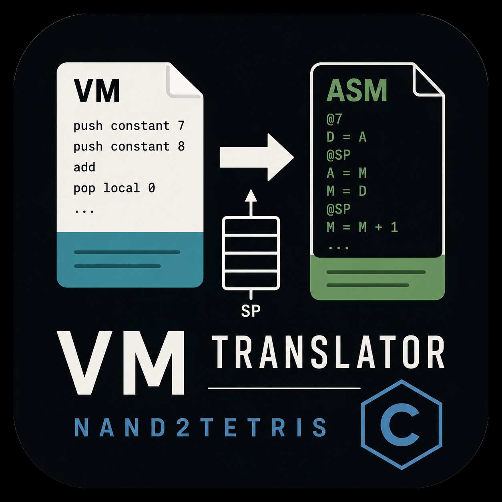

# VM Translator (Nand2Tetris) — C Implementation

<p align="center">
  
</p>

A **VM Translator written in C** as part of the *Nand2Tetris* course/book project.  
This tool translates **Virtual Machine (VM) language** code into **Hack assembly language**, forming a key part of the Nand2Tetris software stack.

---

## 🚀 Overview

The VM Translator is responsible for converting stack-based VM commands into low-level Hack assembly instructions.

This implementation is written in **pure C**, focusing on:

- Low-level memory management
- Clean modular architecture
- Accurate translation of VM specifications
- Following the Nand2Tetris architecture model

---

## 📚 What is VM in Nand2Tetris?

In the Nand2Tetris project, the VM language acts as an **intermediate layer** between high-level language and machine code.

It includes:

- Stack-based arithmetic operations
- Memory segment access
- Program flow (labels, branching)
- Function calls and returns

---

## ⚙️ Features Implemented

This VM Translator supports:

### 🧮 Arithmetic & Logical Operations
- `add`, `sub`, `neg`
- `eq`, `gt`, `lt`
- `and`, `or`, `not`

### 💾 Memory Access
- `push segment index`
- `pop segment index`

Supported segments:
- `constant`
- `local`
- `argument`
- `this`
- `that`
- `temp`
- `pointer`
- `static`

### 🔁 Program Flow
- `label`
- `goto`
- `if-goto`

### 📞 Function Handling
- `function f nVars`
- `call f nArgs`
- `return`

---

## 🏗️ Project str

The project is split into modular components:<br>

src/<br>
│
├── main.c # Entry point<br>
├── parser.c # Parses VM commands<br>
├── code.c # Translates VM → Hack assembly<br>
├── table.c # Symbol / static mapping<br>
├── writer.c # Writes assembly output<br>
└── utils.c # Helper functions<br>
---

## 🔧 Build Instructions

### Compile the project:

```bash
make
```
---
▶️ Usage

Run the translator with an .vm file:
---
📄 License

This project is created for educational purposes as part of the Nand2Tetris learning journey.


